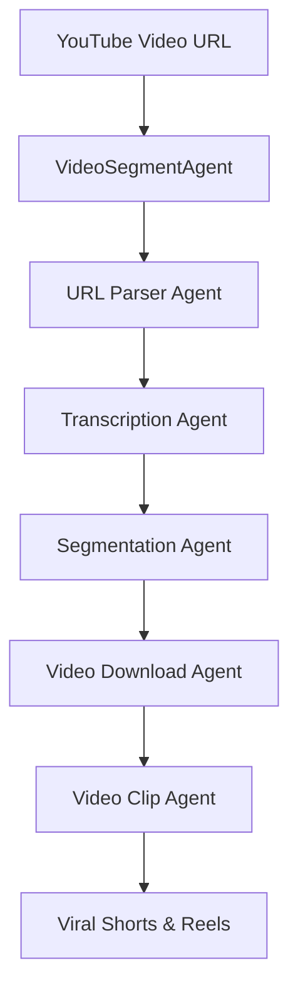

# Frame.AI: Video Segmentation For Short-Form Content Using Collaborative AI Agents

Frame.AI is an innovative **collaborative AI agent system** specifically designed to revolutionize **shorts and reels content generation**. By intelligently analyzing long-form YouTube videos, Frame.AI identifies and extracts high-potential segments that are primed to go viral on platforms like YouTube Shorts, Instagram Reels, and TikTok.

Built with **Google's Agent Development Kit (ADK)**, Frame.AI operates through a sophisticated multi-agent architecture, featuring a central orchestrating agent and four specialized sub-agents. This collaborative approach ensures deep analysis, precise segmentation, and optimized content output.

---

## Features

* **Viral Content Identification:** Leverages advanced AI to pinpoint moments within long-form videos that have the highest potential to become viral shorts or reels.
* **Intelligent Video Segmentation:** Automatically extracts short, engaging segments based on factors like sudden changes, emotional intensity, key phrases, and speaker focus.
* **Contextual Analysis:** Understands the narrative and context of the video to ensure extracted clips are meaningful and standalone.
* **Multi-Agent Collaboration:** A sophisticated system of specialized AI agents working in concert to achieve optimal results.
* **Google ADK Powered:** Built on a robust and scalable framework, ensuring efficient processing and future extensibility.
* **Optimized for Shorts & Reels:** Generates content with ideal aspect ratios, pacing, and engagement hooks for short-form video platforms.
* **Transcription & Keyword Analysis:** Integrates with transcription services to analyze spoken content for trending keywords and impactful dialogue.

---

## Architecture: A Collaborative Agent System

Frame.AI's core strength lies in its multi-agent architecture, orchestrated by a central **Main Orchestrating Agent** that delegates tasks and synthesizes outputs from four specialized **Sub-Agents**. This design, powered by Google's ADK, allows for a highly modular, scalable, and intelligent workflow.

---

## The Agents:

The **VideoSegmentAgent** orchestrates the following sub-agents in a precise sequential flow:

* **URL Parser Agent (`url_parser_agent`):**
    * **Role:** This is our initial gateway. It securely and accurately parses the provided YouTube video URL, validating it and extracting essential details for the next steps.

* **Transcription Agent (`transcription_agent`):**
    * **Role:** This agent dives into the video's audio, converting every spoken word into a detailed transcript. It's crucial for understanding the video's narrative, identifying key phrases, and uncovering moments of high engagement.

* **Segmentation Agent (`segmentation_agent`):**
    * **Role:** The "brain" behind identifying virality. This agent meticulously analyzes the transcribed text, looking for keywords, emotional peaks, rapid topic shifts, and other indicators of viral potential. It then pinpoints precise start and end times for the most compelling clips, applying a sophisticated scoring algorithm.

* **Video Processing Agent (`video_processing_agent`):**
    * **Role:** This comprehensive agent handles all the heavy lifting of video manipulation to bring those segments to life. It's a powerhouse that further breaks down into dedicated sub-tasks:
        * **Video Download Agent (`video_download_agent`):** First, it ensures the full YouTube video is downloaded, ready for manipulation.
        * **Video Clip Agent (`video_clip_agent`):** Next, it precisely extracts the high-potential segments identified by the `segmentation_agent`.
